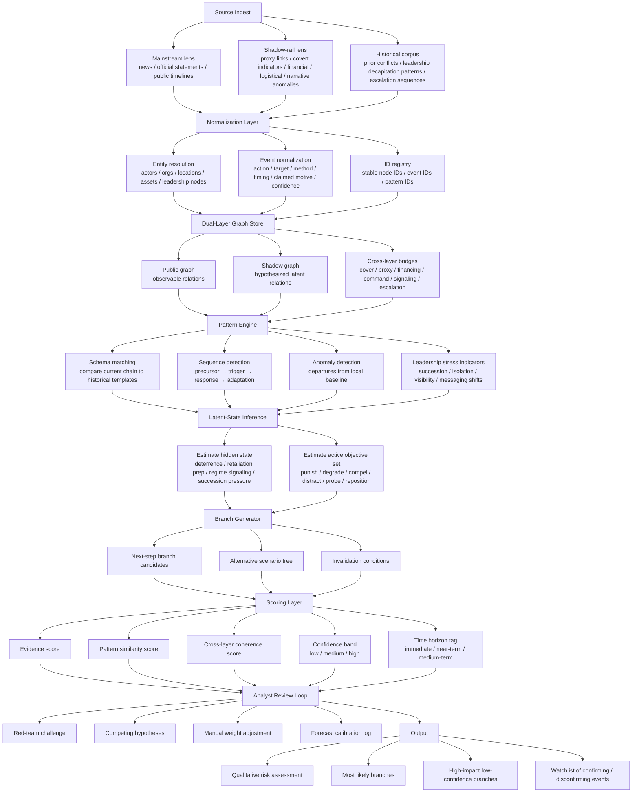

## Dual-layer historical-pattern forecasting stack



## Functional interpretation

### 1. **Ingest**

You collect three kinds of signal:

* **current public events**
* **possible covert / indirect indicators**
* **historical analogs**

That gives you both the **observed surface** and the **candidate hidden mechanism**.

### 2. **Normalize**

Everything becomes machine-comparable:

* stable actor IDs
* stable event IDs
* common event fields
* reusable pattern IDs

This is what lets past cases and current cases be compared structurally rather than narratively.

### 3. **Dual-layer graph**

This is the core design choice.

* **Mainstream layer** = what is directly observable
* **Shadow-rail layer** = inferred but not directly observed
* **Bridges** = the hypothesized mechanisms connecting the two

That makes the system behave less like a flat timeline and more like a **partially observed state model**.

### 4. **Pattern engine**

This asks:

* which historical sequence does the current structure resemble?
* which precursor chains are forming?
* which deviations matter?

This is the most **KAIROS-like** part.

### 5. **Latent-state inference**

This asks:

* what hidden strategic state best explains the visible pattern?
* what objective set is most consistent with the current graph?

Examples of hidden state categories:

* deterrence signaling
* retaliation preparation
* succession stress
* coalition testing
* proxy activation
* bargaining pressure

This is the most important layer for your **shadow graph**.

### 6. **Branch generation**

Instead of one prediction, generate:

* most likely next move
* plausible alternatives
* invalidation triggers

That keeps the output probabilistic rather than prophetic.

### 7. **Scoring**

Each branch should be scored on separate axes, not one blended vibe score:

| Axis                  | Meaning                                               |
| --------------------- | ----------------------------------------------------- |
| Evidence score        | How much direct support exists                        |
| Pattern similarity    | How close the current sequence is to prior templates  |
| Cross-layer coherence | Whether public and shadow layers reinforce each other |
| Confidence band       | How stable the estimate is                            |
| Time horizon          | How soon the branch is expected                       |

### 8. **Analyst review**

This is where the system becomes **HFC-like** rather than fully automated.

The analyst loop should explicitly do:

* competing-hypothesis review
* red-team challenge
* confidence correction
* forecast log update

That reduces narrative lock-in.

---

## Public-program analog map

| Your layer                                    | Closest public analog |
| --------------------------------------------- | --------------------- |
| Event schema + temporal chain matching        | **KAIROS**            |
| Human-guided branch forecasting               | **HFC**               |
| Precursor / anomaly cueing                    | **GIDE**              |
| Confidence calibration / forecast aggregation | **ACE**               |

---

## Recommended minimal scoring object

A clean prediction record would look like this conceptually:

```yaml
prediction_id: P-001
current_state:
  dominant_pattern: retaliatory-escalation-cycle
  latent_state: leadership-pressure-with-controlled-signaling
  time_horizon: near-term

branches:
  - branch_id: B-1
    description: limited retaliatory action via proxy channel
    evidence_score: 0.74
    pattern_similarity: 0.81
    cross_layer_coherence: 0.77
    confidence: medium-high
    confirm_if:
      - specific proxy messaging shifts
      - force repositioning in adjacent theater
    invalidate_if:
      - de-escalatory diplomatic signaling from sponsor node

  - branch_id: B-2
    description: direct high-visibility strike for deterrence restoration
    evidence_score: 0.46
    pattern_similarity: 0.63
    cross_layer_coherence: 0.51
    confidence: medium-low
    confirm_if:
      - leadership hardline rhetoric spikes
      - visible force readiness changes
    invalidate_if:
      - proxy-only response is already executed
```

---

## Best compact mental model

Your system is essentially:

> **historical schema matcher + latent-state graph + analyst-calibrated branch forecaster**

Or, even shorter:

> **event graph → hidden-state estimate → branch probabilities**

---

## One structural improvement

The single most useful addition would be a strict separation between:

* **observed facts**
* **inferred links**
* **forecast branches**

That means every edge and every prediction should carry a field like:

```yaml
assertion_type: observed | inferred | forecast
```

Without that, the graph can drift into mixing evidence and hypothesis.

---

## Recommended next refinement

Build the stack as **five explicit objects**:

1. `event_registry`
2. `entity_graph_mainstream`
3. `entity_graph_shadow`
4. `pattern_library`
5. `prediction_registry`

That will keep the system auditable and make branch scoring easier to update over time.

I can turn this into a **JSON schema set** for those five objects.
